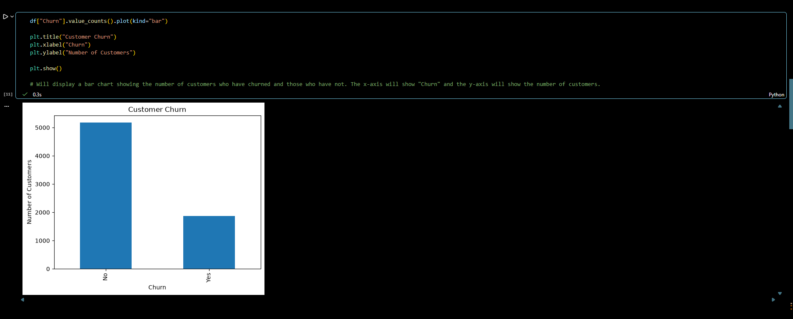
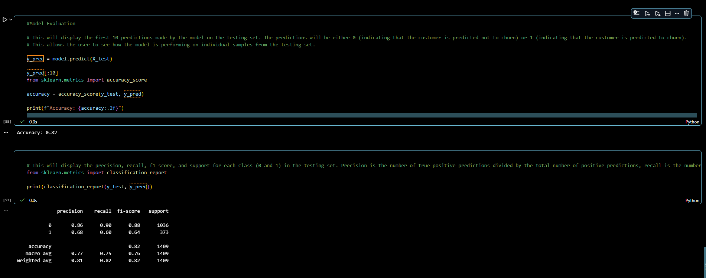

# Customer Churn Prediction

A machine learning project that predicts customer churn using Logistic Regression.

## Project Overview

Customer churn refers to customers who stop using a company's services. Predicting churn helps businesses identify at-risk customers and improve retention strategies.

This project uses the Telco Customer Churn dataset and follows a complete machine learning workflow:

- Data exploration
- Data cleaning
- Data preprocessing
- Feature engineering
- Model training
- Model evaluation

## Dataset

Dataset: Telco Customer Churn

The dataset contains information about 7,043 customers and includes:

- Demographic information
- Account details
- Service subscriptions
- Billing information
- Churn status

### Target Variable

| Value | Meaning |
|---------|---------|
| 0 | Customer stayed |
| 1 | Customer left |

## Technologies Used

- Python
- Pandas
- NumPy
- Matplotlib
- Scikit-learn
- Jupyter Notebook

## Exploratory Data Analysis

Some key findings from the analysis:

- Approximately 26.5% of customers have churned.
- Customers with shorter tenure are more likely to churn.
- Customers with higher monthly charges are more likely to churn.

## Data Preprocessing

The following preprocessing steps were performed:

1. Converted `TotalCharges` to numeric values.
2. Replaced missing values using the median.
3. Converted the target variable (`Churn`) into numerical values.
4. Removed the `customerID` column.
5. Applied one-hot encoding to categorical variables.

## Model Training

The dataset was split into:

- 80% training data
- 20% testing data

A Logistic Regression model was trained using a Scikit-learn Pipeline with:

- StandardScaler
- LogisticRegression

## Results

| Metric | Score |
|----------|----------|
| Accuracy | 0.82 |
| Precision (Churn) | 0.68 |
| Recall (Churn) | 0.60 |
| F1-Score (Churn) | 0.64 |

## Results Visualization

### Customer Churn Distribution

The chart below shows the distribution of customers who stayed versus customers who churned.



### Model Performance

The Logistic Regression model achieved an accuracy of 82% on the test dataset.



## Project Structure

```text
customer-churn-prediction/
│
├── data/
│   └── customer_churn.csv
│
├── images/
│   ├── churn_distribution.png
│   └── model_results.png
│
├── notebooks/
│   └── churn_analysis.ipynb
│
├── README.md
├── requirements.txt
└── .gitignore
```

## Future Improvements

Potential improvements include:

- Random Forest
- XGBoost
- Hyperparameter tuning
- Feature selection
- Cross-validation
- Churn probability analysis

## Author

**Florin Pricop**

This project was created to practice data analysis, data preprocessing, and machine learning concepts using Python and Scikit-learn.